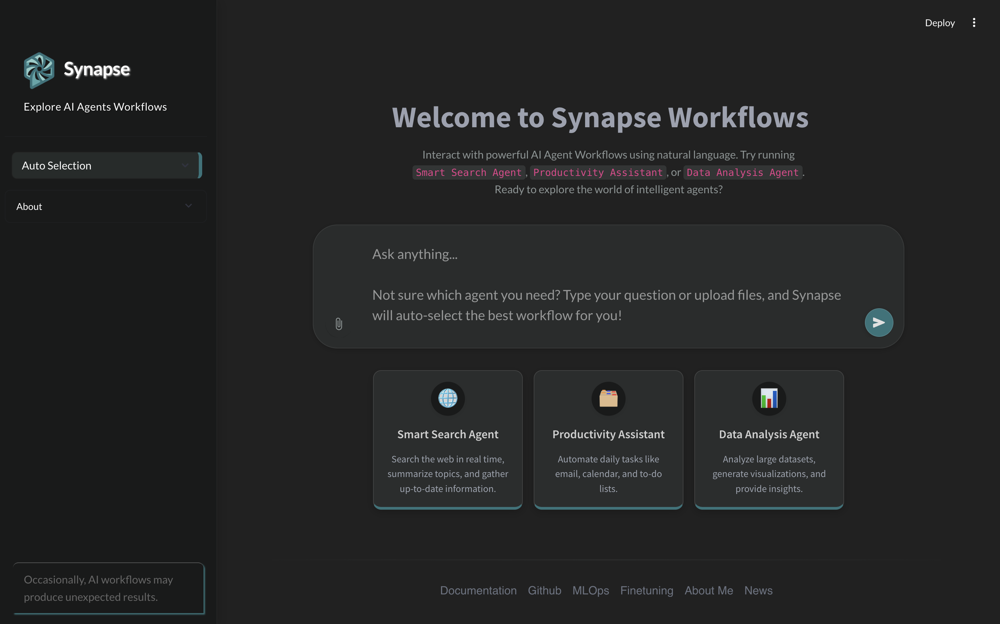

# Synapse Workflows

## Overview
Synapse Workflows is a platform that allows users to interact with specialized AI agents through natural language. The platform offers three main types of intelligent agents designed to assist with different tasks:

## UI Chatbot using Streamlit, HTML, CSS, and JavaScript

1. **Smart Search Agent** - Searches the web in real-time, summarizes topics, and gathers up-to-date information.

2. **Productivity Assistant** - Automates daily tasks including email management, calendar organization, and to-do lists.

3. **Data Analysis Agent** - Analyzes large datasets, generates visualizations, and provides insights.

## Features
- Intuitive natural language interface
- Multiple specialized AI agents for different use cases
- Real-time web search capabilities
- Task automation for productivity
- Data analysis and visualization tools

## Getting Started
Users can begin by selecting one of the three available agents from the main interface or by typing queries directly into the "Ask Anything..." input field.

## Notes
- The platform indicates that AI workflows may occasionally produce unexpected results.
- The interface includes a "Deploy" button in the upper right for deployment options.

## Support
For more detailed information, users can access the documentation section through the link provided at the bottom of the interface.